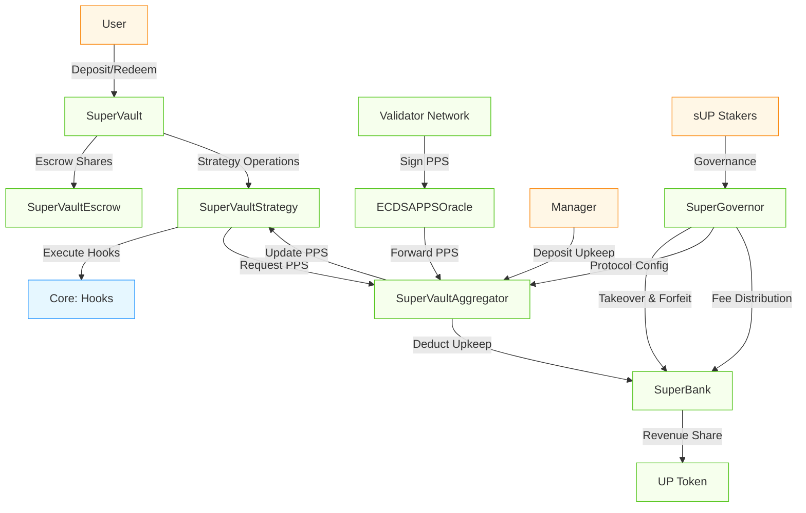

[](https://codecov.io/gh/superform-xyz/v2-periphery)
[](https://opensource.org/licenses/Apache-2.0)

# Overview

Superform v2 Periphery is the user-facing layer built on top of [Superform v2 Core](https://github.com/superform-xyz/v2-core). It provides permissionless vault infrastructure secured by a decentralized validator network, a governance framework with timelocked controls and guardian oversight, and economic coordination through the $UP token.

Periphery currently consists of the following components:

- **SuperVaults**: Permissionlessly creatable, decentralized vaults secured by a validator network that can execute infinitely flexible strategies supporting deterministic PPS, management, and performance fees.
- **UP Token**: $UP is the coordination asset. Staked $UP (sUP) is a SuperVault created for $UP, a governance vault token that confers proposal/voting rights and access to governance-approved economic levers.
- **SuperBank**: Protocol treasury and revenue distribution engine. Receives protocol fees, slashed manager upkeep, and executes governance-approved hook operations for resource allocation.
- **SuperGovernor**: Permissioned registry and access control hub. Manages contract addresses, role-based permissions (SUPER_GOVERNOR, GOVERNOR, GUARDIAN, BANK_MANAGER), timelocked parameter updates, and emergency intervention powers.

📚 [Documentation](https://docs.superform.xyz/) | 🔒 [Audits](https://github.com/superform-xyz/v2-periphery/tree/dev/audits)

## Repository Structure

```
src/
│   ├── SuperVault/     # ERC7540 vault triad (Vault + Strategy + Escrow + Aggregator)
│   ├── UP/             # $UP token
│   ├── Bank.sol        # Base hook execution with Merkle verification
│   ├── SuperBank.sol   # Protocol treasury and revenue distribution
│   ├── SuperGovernor.sol # Role-based access control and contract registry
│   ├── interfaces/     # Periphery interface definitions
│   ├── libraries/      # Utility libraries (errors, types)
│   └── oracles/        # ECDSA PPS oracle and price feed implementations
└── vendor/             # Third-party contracts (NOT IN SCOPE)
```

## Superform Periphery Key Components

The following diagram illustrates the core SuperVault system architecture and key interactions:



### SuperVaults

SuperVaults provide validator-secured ERC7540 vaults that can execute arbitrary hook-based yield strategies while ensuring deterministic pricing and withdrawal guarantees. 

#### SuperVault

The entrypoint vault contract that implements ERC7540 synchronous deposits and asynchronous redeems. Manages share accounting and serves as the user-facing component of the architecture.

#### SuperVaultStrategy

Executes hook bundles, tracks price per share high water mark, queues/fulfills redemption requests, and enforces fee policies. It is the active component that interacts with external protocols.

#### SuperVaultEscrow

Holds user shares during the redemption process rather than burning them immediately, allowing users to cancel pending redemptions if needed. Also holds assets due to be claimed by users at the end of the redemption process.

#### SuperVaultAggregator

Factory and registry for SuperVault triads. Single source of truth for Price-Per-Share (PPS) updates, manager authorization, and strategy pause controls.

### Governance & Coordination

#### UP Token

Utility and governance token for the Superform ecosystem. Staked $UP (sUP) is a SuperVault that confers governance rights and access to protocol revenue.

#### SuperGovernor

Central registry and access control hub for the Superform periphery. Manages role-based permissions, timelocked parameter updates, and emergency intervention powers.

#### SuperBank

Protocol treasury that handles revenue distribution between sUP stakers and the treasury, and executes governance-approved hook operations.  

## Development Setup

### Prerequisites

- Foundry
- Node.js
- Git

### Installation

Clone the repository with submodules:

```bash
git clone --recursive https://github.com/superform-xyz/v2-periphery
cd v2-periphery
```

Install dependencies:

```bash
forge install
```

```bash
cd lib/v2-core/lib/modulekit/
pnpm i
```

```bash
cd lib/v2-core/lib/safe7579
pnpm i
```

```bash
cd lib/v2-core/lib/nexus
yarn
```

Note: This requires pnpm and will not work with npm. Install it using:

```bash
curl -fsSL https://get.pnpm.io/install.sh | sh -
```

Copy the environment file:

```bash
cp .env.example .env
```

### Updating Dependencies

To update a submodule to the latest commit on its tracked branch (e.g., `v2-core` tracking `dev`):

```bash
# Sync submodule configuration from .gitmodules
git submodule sync lib/v2-core

# Update submodule to latest from remote branch
git submodule update --init --remote lib/v2-core

# Update the Foundry lock file
forge update
```

> **Note**: The `.gitmodules` file specifies which branch each submodule tracks (e.g., `branch = dev` for v2-core). The `--remote` flag pulls the latest from that branch.

### Building & Testing

Build:

```bash
forge build
```

Supply your node rpc directly in the makefile and then

```bash
make ftest
```

### Invariant Testing

This repository includes a [Chimera Framework](https://book.getrecon.xyz/writing_invariant_tests/chimera_framework.html) test suite for fuzzing and formal verification.

#### Echidna Setup

```shell
curl -L -o echidna.tar.gz https://github.com/crytic/echidna/releases/download/v2.2.7/echidna-2.2.7-aarch64-macos.tar.gz
chmod +x echidna
sudo mv echidna /usr/local/bin/

# Install crytic-compile
brew install python@3.10
pipx install crytic-compile
pipx ensurepath
```

#### Running Echidna

```shell
echidna ./test/recon/CryticTester.sol --contract CryticTester --config echidna.yaml
```

#### Foundry Reproducers

Broken properties can be turned into unit tests using [Recon's tools](https://getrecon.xyz/tools/echidna):

```shell
forge test --match-test <reproducer-test-name> -vv
```

## License

Apache-2.0