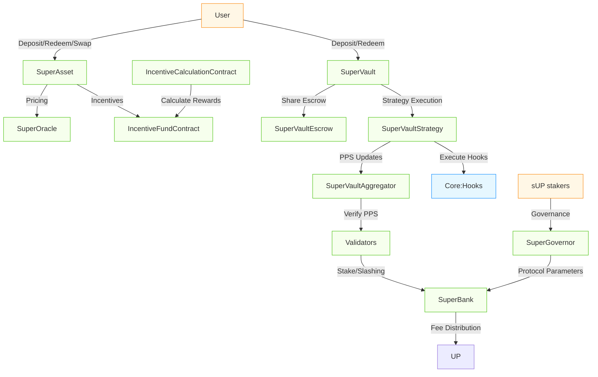

[](https://codecov.io/gh/superform-xyz/v2-periphery)

# Overview

Superform v2 Periphery is a suite of products built on top of the Superform core contracts, providing user-facing savings wrappers, validator-secured vault systems, and governance infrastructure.

This document provides technical details, reasoning behind design choices, and discussion of potential edge cases and risks in Superform's v2 periphery contracts.

The periphery consists of the following components:

- **SuperVaults**: Validator-secured ERC7540 vault system with flexible strategies
- **UP Token & Governance**: Protocol token and governance infrastructure
- **SuperBank**: Protocol fee and resource coordination
- **SuperGovernor**: Governance implementation and contract registry

## Repository Structure

```
src/
│   ├── SuperVault/     # Validator-secured vault system
│   ├── UP/             # Protocol token implementation
│   ├── Bank.sol        # Abstract hook execution contract
│   ├── SuperBank.sol   # Protocol fee and resource coordination
│   ├── SuperGovernor.sol # Governance implementation
│   ├── interfaces/     # Periphery interface definitions
│   ├── libraries/      # Utility libraries for periphery
│   └── oracles/        # PPS oracle and Price feed implementations
└── vendor/             # Vendor contracts (NOT IN SCOPE)
```

## Superform Periphery Key Components

The following diagram illustrates how users interact directly with the periphery system and how the different components work together. Some components, like the SuperAssetFactory and VaultBank, are not included in this given comparative simplicity.



### SuperVaults

SuperVaults provide validator-secured ERC7540 vaults that can execute arbitrary hook-based yield strategies while ensuring deterministic pricing and withdrawal guarantees. The architecture solves the "vault trilemma" of flexibility, security, and usability.

#### SuperVault

The entrypoint vault contract that implements ERC7540 synchronous deposits and asynchronous redeems. Manages share accounting and serves as the user-facing component of the architecture.

Key Points for Auditors:

- Share Accounting:
  - Conversion between share amounts and underlying asset values at off-chain calculated PPS
  - Fee skiming accuracy

- Security Mechanisms:
  - Access controls for administrative functions
  - Integration with strategy, escrow, and aggregator components
  - Delegation of operations to an operator for UX / integrations

#### SuperVaultStrategy

Executes hook bundles, tracks price per share high water mark, queues/fulfills redemption requests, and enforces fee policies. It is the active component that interacts with external protocols.

Key Points for Auditors:

- Hook Execution:
  - Merkle validation of hook bundles against roots from the Aggregator
  - Atomicity of operations within bundles
  - Slippage protection during external protocol interactions
  
- Fee taking capability:
  - PPS Highwater mark tracking for performance fee assessment basis 


#### SuperVaultEscrow

Holds user shares during the redemption process rather than burning them immediately, allowing users to cancel pending redemptions if needed and providing proof of ownership. It also holds assets due to be claimed by users at the end of the redemption process

Key Points for Auditors:

- User Operations:
  - Prevention of unauthorized withdrawals
  - Proper release conditions

#### SuperVaultAggregator

Single source of truth for Price-Per-Share (PPS) updates. Manages managers, deploys new Vault/Strategy/Escrow triads, and can pause misbehaving strategies.

Key Points for Auditors:

- Price Oracle Mechanism:
  - PPS update frequency and limits
  - Manipulation resistance through threshold checks

- Strategist Management:
  - Primary manager has full control over strategy operations
  - Secondary managers can be added/removed by primary manager
  - Superform-approved managers can bypass primary manager via SuperGovernor takeover
  - 7-day timelock for primary manager changes proposed by secondary managers

- Hook Validation System:
  - Global hooks root managed by governance with timelock
  - Strategy-specific hooks root managed by primary manager
  - Guardian role can veto both global and strategy roots to prevent malicious hooks
  - Merkle tree leaves contain `abi.encode(hookArgs)` obtained via hooks' inspect function


#### Hook Root Veto Mechanism

The SuperVault system implements a dual-layer security mechanism for hook execution through vetoed hook roots:

**Veto Protection**: If either the global hooks root or a strategy's hooks root is vetoed (due to containing malicious calldata or malicious hooks), managers cannot execute any hooks from those roots. This prevents execution of potentially harmful operations until the malicious content is removed.

**Strategy-Level Compliance**: Individual strategies can ban specific leaves (hook configurations) from the global root to maintain compliance or transparency requirements. For example, a strategy could permanently ban loop hooks or other operations that don't align with its investment mandate, even if those hooks remain valid in the global root.

This mechanism ensures that hook execution is always subject to both governance oversight and strategy-specific compliance controls.

- Factory Functionality:
  - Permissionless deployment of new vault triads
  - Initialization parameter validation
  - Integration with SuperBank for protocol coordination and fee collection

#### Operational Costs vs Economic Security: Dual System Architecture

The SuperVaultAggregator implements a dual system that separates operational costs from economic security mechanisms, providing both efficient protocol operations and robust defense against malicious behavior.

**Upkeep System (Operational Costs)**:
- **Purpose**: Covers gas costs for PPS updates and oracle operations
- **Mechanism**: Managers deposit UP tokens via `depositUpkeep()` to fund ongoing operations
- **Usage**: Automatically deducted during PPS updates to compensate keepers and validators
- **Accumulation**: Spent upkeep accumulates in `claimableUpkeep` for batch distribution to SuperBank

**Stake System (Economic Security)**:
- **Purpose**: Provides economic security against malicious manager behavior
- **Mechanism**: Managers deposit UP tokens via `depositStake()` as collateral for good behavior
- **Slashing**: SuperGovernor can slash stakes (off-chain enforced) via `slashStake()` for malicious actions
- **Immediate Transfer**: Slashed funds transfer directly to SuperBank without accumulation
- **Independence**: Completely separate from upkeep system - slashing doesn't affect operational costs

**Key Design Benefits**:

1. **Separation of Concerns**: 
   - Upkeep ensures protocol operations continue regardless of manager behavior
   - Stakes create economic disincentives for malicious actions without affecting operations

2. **Flexible Enforcement**:
   - Stake requirements can be enforced off-chain for featured strategies
   - No mandatory staking amounts - governance can set requirements per strategy tier
   - Allows different risk profiles for different types of strategies

3. **Malicious Behavior Defense**:
   - **Slippage Bypass**: Managers who manipulate `expectedAssetsOrSharesOut` to disable slippage protection
   - **Front-running**: Strategists who front-run their own hook executions to extract value
   - **Redemption Manipulation**: Providing arbitrary expected outputs during `fulfillRedeemRequests`
   - **Hook Abuse**: Executing hooks with malicious parameters despite Merkle validation

4. **Operational Efficiency**:
   - Upkeep costs are predictable and separate from security deposits
   - Batch processing of upkeep payments reduces gas costs
   - Immediate slashing provides rapid response to detected malicious behavior

**Example Attack Scenario and Mitigation**:

A malicious manager could:
1. Set `expectedAssetsOrSharesOut = 0` to bypass slippage protection
2. Front-run the transaction with a large swap to manipulate prices
3. Execute the hook with favorable slippage, extracting user funds
4. Back-run to restore prices, keeping the extracted value

With the stake system:
1. The manager must deposit significant UP tokens as stake
2. Off-chain monitoring detects the malicious behavior
3. SuperGovernor immediately slashes the stake (potentially worth more than extracted value)
4. Slashed funds go to SuperBank for protocol treasury or user compensation
5. Economic loss exceeds potential gains, deterring the attack

This dual system ensures that protocol operations remain funded and efficient while creating strong economic incentives for honest manager behavior.

### UP + SuperBank + SuperGovernor

These contracts form the core governance, coordination, and incentive layers for the Superform periphery ecosystem.

#### UP Token

Utility and governance token for the Superform ecosystem. It enables staking for validators, governance participation rights, and protocol incentives. 

sUP is a SuperVault created for UP by the SuperVaultAggregator.

#### SuperGovernor

Central registry for all deployed contracts in the Superform periphery with role-based access control for system governance. It serves as the configuration hub for security parameters and protocol settings.

Key Points for Auditors:

- Contract Registry:
  - Central address registry for all periphery components
  - Role-based access control (SUPER_GOVERNOR_ROLE, GOVERNOR_ROLE, BANK_MANAGER_ROLE)
  - Secure mapping between contract identifiers and addresses

- Hook Security Management:
  - Merkle root management for SuperBank and VaultBank hooks
  - Timelocked root updates with 7-day delay
  - Hook registration and approval workflows

- Protocol Parameter Control:
  - Fee management for revenue share, performance fees, and swap fees
  - Validator registry and quorum requirements
  - PPS oracle configuration and updates
  - Upkeep cost management for protocol operations
  
#### SuperBank

Executes protocol revenue distribution and hook-based operations under governance control. Extends the base Bank contract with Merkle-verified hook execution.
In comparison with SuperVault, the leaves part of the merkle tree is the hash of the target address.

Key Points for Auditors:

- Hook Execution:
  - Merkle-verified hook execution with proofs validated against SuperGovernor
  - Compound protocol operations via executable hooks
  - Security boundaries for hook execution permissions

- Revenue Distribution:
  - Allow for a potential distribution of UP tokens between sUP stakers and treasury
  - Implements governance-controlled revenue share percentages
  - Handles transfer security for token movements
  
- Bank Manager Controls:
  - Role-based restrictions for sensitive operations
  - Role verification through SuperGovernor's access control


## Areas of Interest

To ensure transparency and facilitate the audit process, the following points outline known issues and potential edge cases our team has identified:

### SuperVault Strategist Trust Model

**Risk**:
- Primary managers have significant control over vault strategies
- Malicious hooks could be included in strategy execution

**Mitigation**:
- Guardian role can veto malicious hook roots
- 7-day timelock for manager changes
- SuperGovernor takeover mechanisms for approved managers


### Oracle Dependencies

**Risk**:
- Price feed manipulation or failure could affect SuperAsset operations
- PPS oracle failures could impact SuperVault operations

**Mitigation**:
- Circuit breaker mechanisms for price deviations
- Multiple validation layers for PPS updates
- Fallback mechanisms for oracle failures

### Timelocks

The protocol enforces specific timelock durations across different contracts to ensure safe updates.
These timelocks prevent immediate execution of sensitive operations and allow for community review and intervention if needed.

| **Timelock**               | **Value**      | **Location**             | **Changeable**                         | **Notes** |
|-----------------------------|----------------|---------------------------|----------------------------------------|------------|
| **Strategist change**       | 7 days         | `SuperVaultAggregator`    | ❌ Constant                            | For secondary manager proposals |
| **Hooks root update**       | 15 minutes     | `SuperVaultAggregator`    | ✅ Via `setHooksRootUpdateTimelock()`  | Configurable by `SuperGovernor` |
| **Fee config update**       | 7 days         | `SuperVaultStrategy`      | ❌ Constant                            | For performance fee changes |
| **Emergency withdrawal**    | 7 days         | `SuperVaultStrategy`      | ❌ Constant                            | For emergency mode activation |
| **SuperGovernor operations**| 7 days         | `SuperGovernor`           | ❌ Constant                            | For governance changes |
| **Max staleness**           | Variable (from 1 min to 7 days)       | `SuperVaultAggregator`    | ✅ *Should be configurable*             | Per-strategy, needs implementation |

**Notes**:
- **Immutable Timelocks** (❌ Constant): Defined at deployment and cannot be changed post-deployment.  
- **Configurable Timelocks** (✅): May be updated via the `SuperGovernor` or dedicated setter functions.  
- **Max Staleness**: Currently planned as a *per-strategy parameter* to define acceptable data freshness thresholds for oracle or PPS updates.  

## Development Setup

### Prerequisites

- Foundry
- Node.js
- Git

### Installation

Clone the repository with submodules:

```bash
git clone --recursive https://github.com/superform-xyz/v2-periphery
cd v2-periphery
```

Install dependencies:

```bash
forge install
```

```bash
cd lib/v2-core/lib/modulekit/
pnpm install
```

```bash
cd lib/v2-core/lib/safe7579
yarn
```

```bash
cd lib/v2-core/lib/nexus
yarn
```


Note: This requires pnpm and will not work with npm. Install it using:

```bash
curl -fsSL https://get.pnpm.io/install.sh | sh -
```

Copy the environment file:

```bash
cp .env.example .env
```

### Building & Testing

Build:

```bash
forge build
```

Supply your node rpc directly in the makefile and then

```bash
make ftest
```