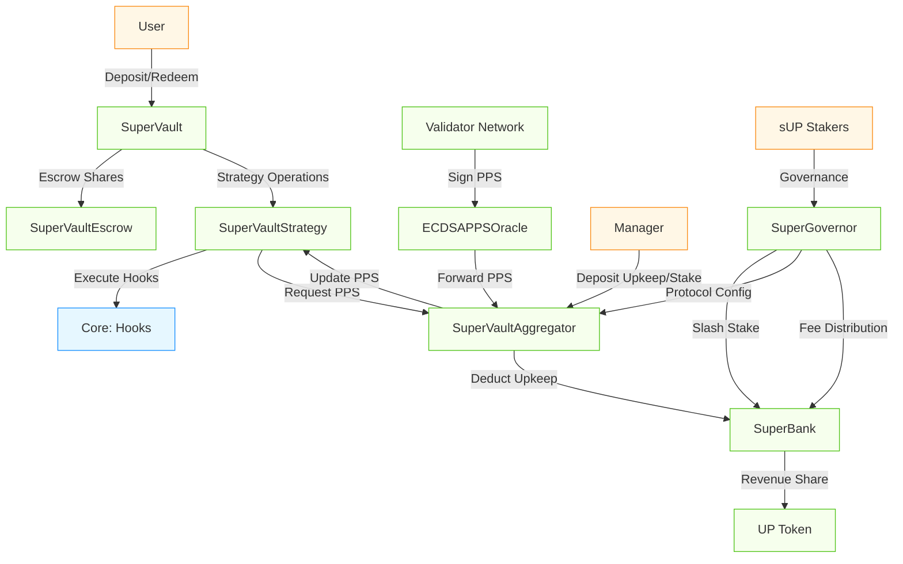

[](https://codecov.io/gh/superform-xyz/v2-periphery)

# Overview

Superform v2 Periphery is a suite of products built on top of the Superform core contracts, providing user-facing savings wrappers, validator-secured vault systems, and governance infrastructure.

This document provides technical details, reasoning behind design choices, and discussion of potential edge cases and risks in Superform's v2 periphery contracts.

The periphery consists of the following components:

- **SuperVaults**: Validator-secured ERC7540 vault system with flexible strategies
- **UP Token & Governance**: Protocol token and governance infrastructure
- **SuperBank**: Protocol fee and resource coordination
- **SuperGovernor**: Governance implementation and contract registry

## Repository Structure

```
src/
│   ├── SuperVault/     # Validator-secured vault system
│   ├── UP/             # Protocol token implementation
│   ├── Bank.sol        # Abstract hook execution contract
│   ├── SuperBank.sol   # Protocol fee and resource coordination
│   ├── SuperGovernor.sol # Governance implementation
│   ├── interfaces/     # Periphery interface definitions
│   ├── libraries/      # Utility libraries for periphery
│   └── oracles/        # PPS oracle and Price feed implementations
└── vendor/             # Vendor contracts (NOT IN SCOPE)
```

## Superform Periphery Key Components

The following diagram illustrates the core SuperVault system architecture and key interactions:



### SuperVaults

SuperVaults provide validator-secured ERC7540 vaults that can execute arbitrary hook-based yield strategies while ensuring deterministic pricing and withdrawal guarantees. The architecture solves the "vault trilemma" of flexibility, security, and usability.

#### SuperVault

The entrypoint vault contract that implements ERC7540 synchronous deposits and asynchronous redeems. Manages share accounting and serves as the user-facing component of the architecture.

**Key Points for Auditors:**

- **Share Accounting & Rounding**:
  - Share/asset conversions at validator-calculated PPS with precision tracking
  - Conservative rounding (favors vault): floor for user benefits, ceiling for protocol fees
  - See [PR #153](https://github.com/superform-xyz/v2-periphery/pull/153) for 1-2 wei dust loss analysis (expected behavior)

- **Async Redemption Flow**:
  - Request → Escrow → Fulfill/Cancel state machine
  - Average redemption price tracking per controller
  - Supply conservation: shares moved to escrow, not burned until fulfillment

- **Access Control & Delegation**:
  - Operator delegation for improved UX and integrations
  - Strategy/escrow/aggregator integration points
  - Pause state propagation from aggregator

#### SuperVaultStrategy

Executes hook bundles, tracks price per share high water mark, queues/fulfills redemption requests, and enforces fee policies. It is the active component that interacts with external protocols.

**Key Points for Auditors:**

- **Hook Execution & Validation**:
  - Dual Merkle root system: global (governance) + strategy-specific (manager)
  - Guardian veto mechanism for malicious roots
  - Strategy-level leaf banning for compliance
  - `expectedAssetsOrSharesOut` slippage protection against honest errors and malicious manipulation
  - Atomicity: entire bundle reverts on any hook failure

- **Redemption Fulfillment**:
  - Manager discretion: timing, ordering, partial fulfillment
  - Loss attribution: redeem losses go to redeemer, rebalance losses socialized
  - User slippage protection: fulfillment price in `[user_min, SV_PPS]`
  - MEV protection: manager can delay fulfillment until yield contribution

- **Fee Management**:
  - PPS high-water mark for performance fee basis
  - 12-hour post-unpause skim cooldown (security constraint)
  - 7-day timelock for fee configuration changes 


#### SuperVaultEscrow

Holds user shares during the redemption process rather than burning them immediately, allowing users to cancel pending redemptions if needed and providing proof of ownership. It also holds assets due to be claimed by users at the end of the redemption process.

**Key Points for Auditors:**

- **Share Custody & Lifecycle**:
  - Holds shares from `requestRedeem` until `cancelRedeem` or fulfillment
  - Holds assets from fulfillment until user claims
  - Only strategy can trigger share burns (during fulfillment)
  - Supply invariant: `totalSupply() = Σ(user balances) + escrow balance`

- **Security Boundaries**:
  - No direct user withdrawals (only through vault claim flow)
  - Approval-based transfer mechanism with vault
  - Accumulator tracking for cost basis preservation

#### SuperVaultAggregator

Single source of truth for Price-Per-Share (PPS) updates. Manages managers, deploys new Vault/Strategy/Escrow triads, and can pause misbehaving strategies.

**Key Points for Auditors:**

- **PPS Oracle Security (11 Validation Properties)**:
  - Multi-signature validation via ECDSAPPSOracle (quorum + ordering + registry checks)
  - Defense-in-depth: timestamp checks, monotonicity, staleness, deviation thresholds
  - Post-unpause re-anchoring (C1-RE_ANCHOR): prevents replay of pre-pause signatures
  - Graceful degradation: business logic rejections use `return` not `revert` to continue batch processing
  - Nonce burning on rejection: prevents replay of fundamentally invalid data
  - See `security_properties.md` for complete 11-property analysis

- **DoS/Frontrunning Resistance**:
  - Validator pre-flight simulation: only submit transactions that will succeed
  - Economic disincentives: validators forfeit upkeep payment on failed submissions
  - Manager staleness configuration provides liveness flexibility
  - See validator network assumptions and frontrunning analysis in documentation

- **Manager Hierarchy & Timelocks**:
  - Primary manager: full strategy control (hooks, fees, fulfillment)
  - Secondary managers: configurable by primary, can propose primary change with 7-day timelock
  - SuperGovernor takeover: approved managers can bypass primary via governance
  - 15-minute hooks root update timelock (configurable by governance)

- **Hook Validation System**:
  - Global hooks root: governance-managed with timelock
  - Strategy hooks root: manager-managed per strategy
  - Guardian veto: blocks malicious roots (both global and strategy-level)
  - Leaf banning: strategies can permanently ban specific hook configurations
  - Merkle leaves: `abi.encode(hookArgs)` from hook inspect functions


#### Hook Root Veto Mechanism

The SuperVault system implements a dual-layer security mechanism for hook execution through vetoed hook roots:

**Veto Protection**: If either the global hooks root or a strategy's hooks root is vetoed (due to containing malicious calldata or malicious hooks), managers cannot execute any hooks from those roots. This prevents execution of potentially harmful operations until the malicious content is removed.

**Strategy-Level Compliance**: Individual strategies can ban specific leaves (hook configurations) from the global root to maintain compliance or transparency requirements. For example, a strategy could permanently ban loop hooks or other operations that don't align with its investment mandate, even if those hooks remain valid in the global root.

This mechanism ensures that hook execution is always subject to both governance oversight and strategy-specific compliance controls.

- Factory Functionality:
  - Permissionless deployment of new vault triads
  - Initialization parameter validation
  - Integration with SuperBank for protocol coordination and fee collection

#### Operational Costs vs Economic Security: Dual System Architecture

The SuperVaultAggregator implements a dual system that separates operational costs from economic security mechanisms, providing both efficient protocol operations and robust defense against malicious behavior.

**Upkeep System (Operational Costs)**:
- **Purpose**: Covers gas costs for PPS updates and oracle operations
- **Mechanism**: Managers deposit UP tokens via `depositUpkeep()` to fund ongoing operations
- **Usage**: Automatically deducted during PPS updates to compensate keepers and validators
- **Accumulation**: Spent upkeep accumulates in `claimableUpkeep` for batch distribution to SuperBank

**Stake System (Economic Security)**:
- **Purpose**: Provides economic security against malicious manager behavior
- **Mechanism**: Managers deposit UP tokens via `depositStake()` as collateral for good behavior
- **Slashing**: SuperGovernor can slash stakes (off-chain enforced) via `slashStake()` for malicious actions
- **Immediate Transfer**: Slashed funds transfer directly to SuperBank without accumulation
- **Independence**: Completely separate from upkeep system - slashing doesn't affect operational costs

**Key Design Benefits**:

1. **Separation of Concerns**: 
   - Upkeep ensures protocol operations continue regardless of manager behavior
   - Stakes create economic disincentives for malicious actions without affecting operations

2. **Flexible Enforcement**:
   - Stake requirements can be enforced off-chain for featured strategies
   - No mandatory staking amounts - governance can set requirements per strategy tier
   - Allows different risk profiles for different types of strategies

3. **Malicious Behavior Defense**:
   - **Slippage Bypass**: Managers who manipulate `expectedAssetsOrSharesOut` to disable slippage protection
   - **Front-running**: Strategists who front-run their own hook executions to extract value
   - **Redemption Manipulation**: Providing arbitrary expected outputs during `fulfillRedeemRequests`
   - **Hook Abuse**: Executing hooks with malicious parameters despite Merkle validation

4. **Operational Efficiency**:
   - Upkeep costs are predictable and separate from security deposits
   - Batch processing of upkeep payments reduces gas costs
   - Immediate slashing provides rapid response to detected malicious behavior

**Example Attack Scenario and Mitigation**:

A malicious manager could:
1. Set `expectedAssetsOrSharesOut = 0` to bypass slippage protection
2. Front-run the transaction with a large swap to manipulate prices
3. Execute the hook with favorable slippage, extracting user funds
4. Back-run to restore prices, keeping the extracted value

With the stake system:
1. The manager must deposit significant UP tokens as stake
2. Off-chain monitoring detects the malicious behavior
3. SuperGovernor immediately slashes the stake (potentially worth more than extracted value)
4. Slashed funds go to SuperBank for protocol treasury or user compensation
5. Economic loss exceeds potential gains, deterring the attack

This dual system ensures that protocol operations remain funded and efficient while creating strong economic incentives for honest manager behavior.

### UP + SuperBank + SuperGovernor

These contracts form the core governance, coordination, and incentive layers for the Superform periphery ecosystem.

#### UP Token

Utility and governance token for the Superform ecosystem. It enables staking for validators, governance participation rights, and protocol incentives. 

sUP is a SuperVault created for UP by the SuperVaultAggregator.

#### SuperGovernor

Central registry for all deployed contracts in the Superform periphery with role-based access control for system governance. It serves as the configuration hub for security parameters and protocol settings.

**Key Points for Auditors:**

- **Role-Based Access Control**:
  - DEFAULT_ADMIN_ROLE: manages all other roles
  - SUPER_GOVERNOR_ROLE: critical system parameters (fees, validators, oracle config)
  - GOVERNOR_ROLE: daily operational parameters
  - BANK_MANAGER_ROLE: revenue distribution and hook execution authority
  - GUARDIAN_ROLE: emergency veto powers for malicious hooks

- **Contract Registry & Address Management**:
  - Central mapping of contract identifiers to addresses
  - Non-zero validation on all registered addresses
  - Authorized role requirements for updates
  - Integration point for all periphery components

- **Hook Security & Governance**:
  - Global Merkle root management (SuperBank, VaultBank)
  - 7-day timelock for root updates
  - Hook registration and approval workflows
  - Guardian veto mechanism for malicious hooks

- **Protocol Configuration**:
  - Fee management: revenue share, performance fees, management fees
  - Validator registry: add/remove validators, set quorum requirements
  - PPS oracle: configure active oracle, update intervals, staleness limits
  - Upkeep costs: set per-update costs for validator compensation
  - Manager takeover: authorize managers for strategy control transfers
  
#### SuperBank

Executes protocol revenue distribution and hook-based operations under governance control. Extends the base Bank contract with Merkle-verified hook execution.

**Key Points for Auditors:**

- **Hook Execution System**:
  - Merkle tree structure: leaves = `keccak256(bytes.concat(keccak256(abi.encodePacked(target))))`
  - Different from SuperVault: validates target addresses, not hook arguments
  - Governance-controlled root via SuperGovernor (7-day timelock)
  - Guardian veto mechanism for malicious roots
  - 5-phase execution: setContext → build → validate → execute → reset

- **Revenue Distribution Logic**:
  - Allows distribution (potential) UP tokens between sUP vault (stakers) and treasury
  - Revenue share percentage: governance-controlled via SuperGovernor
  - Balance checks: sufficient UP balance before distribution
  - Exact transfer accounting: `supAmount + treasuryAmount == totalAmount`
  - Recipient validation: sUP and treasury addresses must be non-zero

- **Access Control & Security**:
  - BANK_MANAGER_ROLE: required for revenue distribution and hook execution
  - Role verification through SuperGovernor's access control system
  - Operation authorization tied to governance decisions
  - Integration with stake slashing (receives slashed manager stakes)


## Key Audit Areas & Assumptions

### Trust Model & Economic Incentives

**Manager Trust Assumptions**:
- Managers are trusted for: fulfillment timing, fee configuration, yield source selection, emergency operations, and solvency maintenance
- MEV Guardian role: Managers have discretionary fulfillment power to protect against MEV extraction
- Off-chain enforcement: Managers can be slashed for misbehavior via SuperGovernor
- Mitigation: Guardian veto, 7-day timelocks, SuperGovernor takeover, economic security via stake system

**Validator Network Model**:
- Validators are NOT trusted for timely PPS updates (liveness is best-effort)
- Managers are trusted to configure meaningful `maxStaleness` parameters per strategy
- Oracle assumptions: Pre-flight simulation, minimum update intervals, no future timestamps, economic incentives for honest behavior

**User Assumptions**:
- Users understand that rebalance losses are socialized by design. Redeem losses are attributed to the redeemer.
- Users configure slippage protection (default: 1% on redemptions) to guard against PPS variations
- Users are expected not to abuse slippage parameter changes between request and fulfillment

### PPS & Fee Mechanism Design

**Bid-Ask Model**:
- Deposits execute at current `SV_PPS` (ask price)
- Redemptions: Manager sets fulfillment price within range `[user_min_slippage, SV_PPS]` (bid price), absorbing losses

**Performance Fee Skimming**:
- Decoupled from PPS updates for gas optimization (hourly updates vs less frequent skims)
- Security constraint: 12-hour cooldown post-unpause before skim operations
- Prevents manager exploitation of potentially aberrant PPS after recovery events

**ExpectedAmountOut Protection**:
- Protects against honest strategist errors during hook execution
- Slippage guards ensure hooks execute with expected outcomes

### Token & Protocol Support

**Token Compatibility**:
- Standard ERC20 tokens only (no fee-on-transfer, no ERC777, no rebasing)
- These edge cases are explicitly out of scope

### Some extra suggested audit Focus Areas

**1. Rounding & Dust Handling**
- **Issue**: Potential 1-2 wei dust loss in redemption claims due to conservative rounding
- **Analysis**: [PR #153](https://github.com/superform-xyz/v2-periphery/pull/153) - Conservative rounding implementation
- **Protocol Position**: NOT considered a bug; correct design that favors vault solvency
- **Key Points**:
  - Rounding always favors the vault (floor for user benefits, ceil for protocol fees)
  - Edge case: 2 wei maximum loss to user in tiny dust amounts
  - Critical: no loss "from vault" that could cause insolvency
- **Auditor Focus**: Verify no hidden issues where vault could lose funds (inverse direction)

**2. PPS Update DoS & Frontrunning**
- **Context**: Ties to validator/keeper network assumptions (see assumptions docs)
- **Attack Surface**:
  - Nonce burning: attackers trigger business logic rejections to burn signatures
  - Validator griefing: frontrun oracle submissions to cause state changes
  - Batch DoS: manipulate per-strategy state to fail individual updates
- **Mitigations**:
  - Pre-flight simulation: validators only submit transactions expected to succeed
  - Economic cost: failed submissions forfeit upkeep payments
  - Graceful degradation: rejections use `return` not `revert` for batch continuity
  - Nonce burning intentional: prevents replay of invalid signatures
  - Most attacks require privileged access or have medium economic cost
- **Risk Assessment**: MEDIUM-LOW overall, safe for production
- **Auditor Focus**: 
  - Validate all 11 PPS validation properties (see `security_properties.md`)
  - Check for new attack vectors in oracle → aggregator → strategy flow
  - Verify staleness/liveness tradeoffs in pause/unpause scenarios
  - Review validator network assumptions for completeness

### Timelocks

The protocol enforces specific timelock durations across different contracts to ensure safe updates.
These timelocks prevent immediate execution of sensitive operations and allow for community review and intervention if needed.

| **Timelock**               | **Value**      | **Location**             | **Changeable**                         | **Notes** |
|-----------------------------|----------------|---------------------------|----------------------------------------|------------|
| **Strategist change**       | 7 days         | `SuperVaultAggregator`    | ❌ Constant                            | For secondary manager proposals |
| **Hooks root update**       | 15 minutes     | `SuperVaultAggregator`    | ✅ Via `setHooksRootUpdateTimelock()`  | Configurable by `SuperGovernor` |
| **Fee config update**       | 7 days         | `SuperVaultStrategy`      | ❌ Constant                            | For performance fee changes |
| **Emergency withdrawal**    | 7 days         | `SuperVaultStrategy`      | ❌ Constant                            | For emergency mode activation |
| **SuperGovernor operations**| 7 days         | `SuperGovernor`           | ❌ Constant                            | For governance changes |
| **Max staleness**           | Variable (from 1 min to 7 days)       | `SuperVaultAggregator`    | ✅ *Should be configurable*             | Per-strategy, needs implementation |

**Notes**:
- **Immutable Timelocks** (❌ Constant): Defined at deployment and cannot be changed post-deployment.  
- **Configurable Timelocks** (✅): May be updated via the `SuperGovernor` or dedicated setter functions.  
- **Max Staleness**: Currently planned as a *per-strategy parameter* to define acceptable data freshness thresholds for oracle or PPS updates.  

## Development Setup

### Prerequisites

- Foundry
- Node.js
- Git

### Installation

Clone the repository with submodules:

```bash
git clone --recursive https://github.com/superform-xyz/v2-periphery
cd v2-periphery
```

Install dependencies:

```bash
forge install
```

```bash
cd lib/v2-core/lib/modulekit/
pnpm install
```

```bash
cd lib/v2-core/lib/safe7579
yarn
```

```bash
cd lib/v2-core/lib/nexus
yarn
```


Note: This requires pnpm and will not work with npm. Install it using:

```bash
curl -fsSL https://get.pnpm.io/install.sh | sh -
```

Copy the environment file:

```bash
cp .env.example .env
```

### Building & Testing

Build:

```bash
forge build
```

Supply your node rpc directly in the makefile and then

```bash
make ftest
```